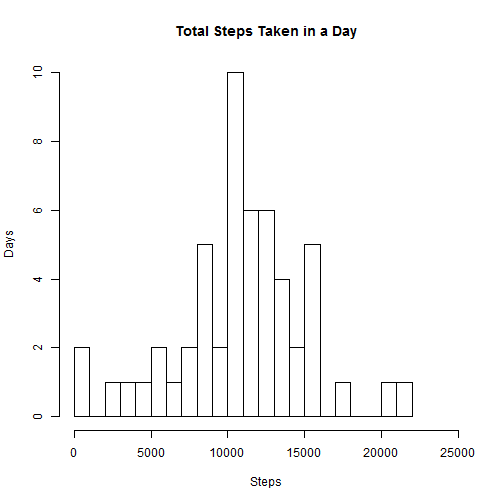

activity.csv is assumed to be in the working directory.  The file is read and the total steps on each recorded day is found.


```r
  activity <- read.csv("activity.csv")
  daySteps <- as.numeric(aggregate(steps ~ date, data = activity,FUN = sum)[,2])
  hist(daySteps,breaks=25,xlim=c(0,25000),main="Total Steps Taken in a Day",ylab="Days",xlab ="Steps")  
```

 

The median number of steps taken per day is 10765 steps.  The mean number of steps taken per day is 10766.2 steps.

Next, we determine the average daily pattern.

```r
  require(lattice)
```

```
## Loading required package: lattice
```

```r
  aveStepsInt <- as.data.frame(aggregate(steps ~ interval, data = activity,FUN = mean))
  aveStepsInt$time <- paste(floor(aveStepsInt$interval/100),aveStepsInt$interval %% 100,sep=":")
  aveStepsInt$time <- as.POSIXct(aveStepsInt$time,format="%H:%M")
  xyplot(steps ~ interval,data=aveStepsInt,type="l",xlab="Time Interval", ylab="Steps",main="Average Number of Steps by Time Interval")  
```

 

The 5-minute interval on average that contains the maximum number of steps is 08:35 .  That is, the subjects appear to be most active in the mid-morning.

The total number of missing values in the dataset is 2304.

Next, find the median by both interval and date.  Median is chosen as the measure of center since it is more robust than the mean and best represents the steps taken in an average time period.

```r
  ##Find the mean for each interval and verify that all intervals are non-empty
  aggInterval <- aggregate(data=activity,steps~interval,FUN='median')
  length(aggInterval$steps) == length(aveStepsInt$time)
```

```
## [1] TRUE
```

```r
  ##Find the mean for each date and discover that several dates are not represented
  aggDate <- aggregate(data=activity,steps~date,FUN='median')
  length(aggDate$steps) == 31 + 30
```

```
## [1] FALSE
```
Note, all interval time periods have at least one complete record.  Next, activityMerge is defined as a new dataset that is equal to the original dataset with the median interval data replacing the empty step values.  

```r
  activityMerge <- merge(x=activity,y=aggInterval, by='interval')
  colnames(activityMerge) <- c("interval","steps.Raw","date","median")
  activityMerge$steps[is.na(activityMerge$steps.Raw)] <- activityMerge$median[is.na(activityMerge$steps.Raw)]
  activityMerge <- activityMerge[,c(5,3,1)]
```
Total number of steps taken each day is now found with the imputed values

```r
  dayStepsMerge <- as.numeric(aggregate(steps ~ date, data = activityMerge,FUN = sum)[,2])
  hist(dayStepsMerge,breaks=25,xlim=c(0,25000),main="Total Steps Taken in a Day (Some Values Imputed)",ylab="Days",xlab ="Steps")
```

 

The median number of steps taken per day is 10395 steps.  The mean number of steps taken per day is 9503.9 steps.  When compared to the original data, imputating missing values by the median of the time interval causes a decrease of 3% in the median and 12% in the mean. 


```r
  activityMerge$WeekendOrWeekday[weekdays(as.Date(activityMerge$date,format="%Y-%m-%d")) == "Saturday" | weekdays(as.Date(activityMerge$date,format="%Y-%m-%d")) == "Sunday"] <- "Weekend"
  activityMerge$WeekendOrWeekday[is.na(activityMerge$WeekendOrWeekday)] <- "Weekday"
  aveStepsIntMerge <- as.data.frame(aggregate(steps ~ interval + WeekendOrWeekday, data = activityMerge,FUN = mean))  
  xyplot(steps ~ interval | WeekendOrWeekday,data=aveStepsIntMerge,type="l",xlab="Time Interval", ylab="Steps", main="Average Number of Steps by Time Interval (Some Values Imputed)")
```

 
